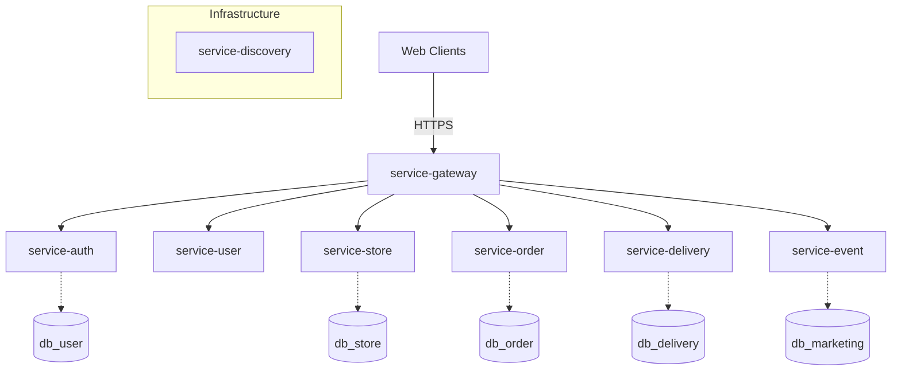

# 🛵 음식 배달 및 통합 매장 관리 시스템


> 배달 주문과 매장 운영을 통합하기 위한 MSA 기반 프로젝트입니다.

---

## 📅 프로젝트 진행 현황 (현재 코드 기준)
- [x] 프로젝트 기획/문서화 (`docs/01~11`)
- [x] 백엔드 인프라 골격 (`service-discovery`, `service-gateway`, `service-*` 모듈)
- [~] 인증/회원 기능 일부 구현 (`service-auth`, `service-user`)
- [~] 프론트 초기 화면 구성 (`web-admin`, `web-shop`, `web-customer`)
- [ ] 핵심 도메인 E2E 플로우(주문 생성→상태전이→조회) 완성
- [ ] 모바일 앱 디렉토리/구현

---

## 🗂 현재 디렉토리 구조

```text
FoodDeliveryAndIntegratedStoreManagementSystem/
├── backend/
│   └── msa-root/
│       ├── service-auth/
│       ├── service-delivery/
│       ├── service-discovery/
│       ├── service-event/
│       ├── service-gateway/
│       ├── service-order/
│       ├── service-store/
│       └── service-user/
├── frontend/
│   ├── web-admin/
│   ├── web-customer/
│   └── web-shop/
├── docs/
└── README.md
```

---

## 🛠 기술 스택 (현재 코드 기준)

### Backend
- Framework: Spring Boot (멀티모듈 구성)
- Language: Java 17+
- Discovery: Netflix Eureka (`service-discovery`)
- Gateway: Spring Cloud Gateway (`service-gateway`)
- Database: PostgreSQL 중심 설정
- Migration: Flyway 설정 존재(서비스별 활성화 정책 상이)

### Frontend
- Framework: Nuxt 3
- UI: Nuxt UI / Tailwind 기반 스타일
- Apps: `web-admin`, `web-shop`, `web-customer`

### 추후 추가 예정 (Planned)
- Backend
    - OpenFeign 기반 서비스 간 통신 표준화 (timeout / fallback 포함)
    - Config Server 또는 공통 설정 관리 체계 도입
    - 비동기 이벤트 처리(Kafka 등 메시지 브로커) 도입
    - 결제 도메인 전용 서비스 분리(`service-payment`) 검토
- Frontend
    - 고객/매장/관리 화면의 실데이터 API 연동 고도화
    - 상태 관리 표준(Pinia store 구조 규칙) 통일
- Mobile
    - Android 앱 프로젝트 디렉토리 구성 및 네이티브 클라이언트 연동
- DevOps / Ops
    - Docker/Kubernetes 배포 템플릿 정식화
    - 관측성(로그/메트릭/트레이싱) 및 알림 체계 도입

---

## 🏗 시스템 구성도 (현재 모듈 기준)



---

## 📚 문서
- 상세 진행상황: `docs/10_Current_Progress_Status.md`
- 우선순위 작업 목록: `docs/11_Priority_Worklist.md`
- 문서 인덱스: `docs/index`
