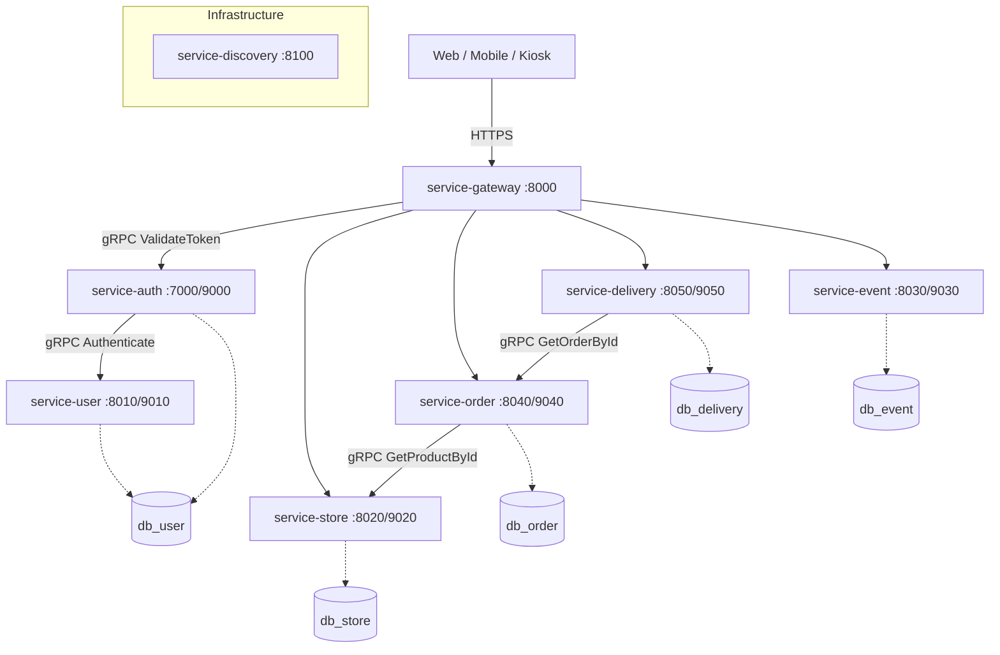

# 🛵 음식 배달 및 통합 매장 관리 시스템


> 배달 주문과 매장 운영을 통합하기 위한 MSA 기반 프로젝트입니다.

---

## 📅 프로젝트 진행 현황 (2026-03-15 기준)
- [x] 프로젝트 기획/문서화 (`docs/01~13`)
- [x] 백엔드 인프라 골격 (`service-discovery`, `service-gateway`, `service-*` 모듈)
- [x] 인증/회원 기능 구현 (`service-auth`, `service-user`) — JWT, 소셜 로그인(Google)
- [x] Spring gRPC 1.0.2 GA 기반 서비스 간 통신 구현
- [x] 프론트 웹앱 3종 구축 (`web-admin`, `web-shop`, `web-user`)
- [x] 핵심 도메인 E2E 플로우 완성 — 주문 생성→상태전이→조회 (Playwright 14단계 통과)
- [x] Android 앱 4종 스캐폴드 (`app-android-shop`, `app-android-user`, `app-android-kiosk`, `app-android-delivery`)
- [ ] Android 앱 백엔드 API 연동
- [ ] Dockerfile / K8s 배포 자동화

---

## 🗂 현재 디렉토리 구조

```text
FoodDeliveryAndIntegratedStoreManagementSystem/
├── backend/
│   └── msa-root/
│       ├── service-auth/         # 인증, JWT 발급/검증, 소셜 로그인
│       ├── service-delivery/     # 배달 관리
│       ├── service-discovery/    # Eureka 서비스 레지스트리
│       ├── service-event/        # 이벤트/쿠폰
│       ├── service-gateway/      # API Gateway (JWT 검증, 라우팅)
│       ├── service-order/        # 주문 관리
│       ├── service-store/        # 매장/메뉴 관리
│       ├── service-user/         # 사용자, 주소, 장바구니, 즐겨찾기
│       ├── database/             # SQL 스키마, 시드, 검증 스크립트
│       └── config/               # Checkstyle, IDE 설정
├── frontend/
│   ├── web-admin/                # 관리자 대시보드 (Nuxt, port 3000)
│   ├── web-shop/                 # 매장 운영 대시보드 (Nuxt, port 3100)
│   ├── web-user/                 # 고객 배달 웹앱 (Nuxt, port 3200)
│   ├── app-android-shop/         # 매장용 Android 앱 (SDK 34)
│   ├── app-android-user/         # 고객용 Android 앱 (SDK 34)
│   ├── app-android-kiosk/        # 키오스크용 Android 앱 (SDK 34)
│   └── app-android-delivery/     # 라이더/배달용 Android 앱 (SDK 34)
├── docs/                         # 프로젝트 문서 (01~13)
└── README.md
```

---

## 🛠 기술 스택 (실제 코드 기준)

### Backend
| 항목 | 기술 |
|------|------|
| Framework | Spring Boot 4.0.2 |
| Language | Java 17 (Eclipse Temurin) |
| Build | Gradle 9.2.1 (Groovy DSL, 멀티모듈) |
| Discovery | Netflix Eureka |
| Gateway | Spring Cloud Gateway (WebFlux) |
| 내부 통신 | Spring gRPC 1.0.2 GA / io.grpc 1.77.1 / Protobuf 4.33.2 |
| 인증 | jjwt 0.12.6 (JWT), Google OAuth2 |
| DB (local) | H2 in-memory |
| DB (prod) | PostgreSQL (서비스별 독립 DB) |
| ORM | Spring Data JDBC (JPA 미사용) |
| 코드 포맷 | Spotless + google-java-format 1.19.2, Checkstyle 10.21.1 |

### Frontend (Web)
| 항목 | 기술 |
|------|------|
| Framework | Nuxt 4.2.2 (Vue 3, TypeScript) |
| UI | @nuxt/ui 4.3.0 (Tailwind CSS) |
| 상태 관리 | composable (useApi, useAuth, useOrdering 등) |
| HTTP Client | Ofetch (Nuxt 내장) |
| 패키지 관리 | pnpm 10.26.1 |
| E2E 테스트 | Playwright |

### Frontend (Mobile)
| 항목 | 기술 |
|------|------|
| 플랫폼 | Android SDK 34 (minSdk 24) |
| 빌드 | Gradle 8.1.1 |
| UI | Material Design 1.10.0, ConstraintLayout |
| 앱 | shop / user / kiosk (3종) |

---

## 🏗 시스템 구성도



---

## 📚 문서
- 문서 인덱스: `docs/index`
- 상세 진행상황: `docs/10_Current_Progress_Status.md`
- 우선순위 작업 목록: `docs/11_Priority_Worklist.md`
- API 문서: `backend/msa-root/API_DOCUMENTATION.md`
- 프론트엔드 API 목록: `docs/FRONTEND_API_LIST.md`
- 보안 감사: `docs/13_Security_Audit.md`
