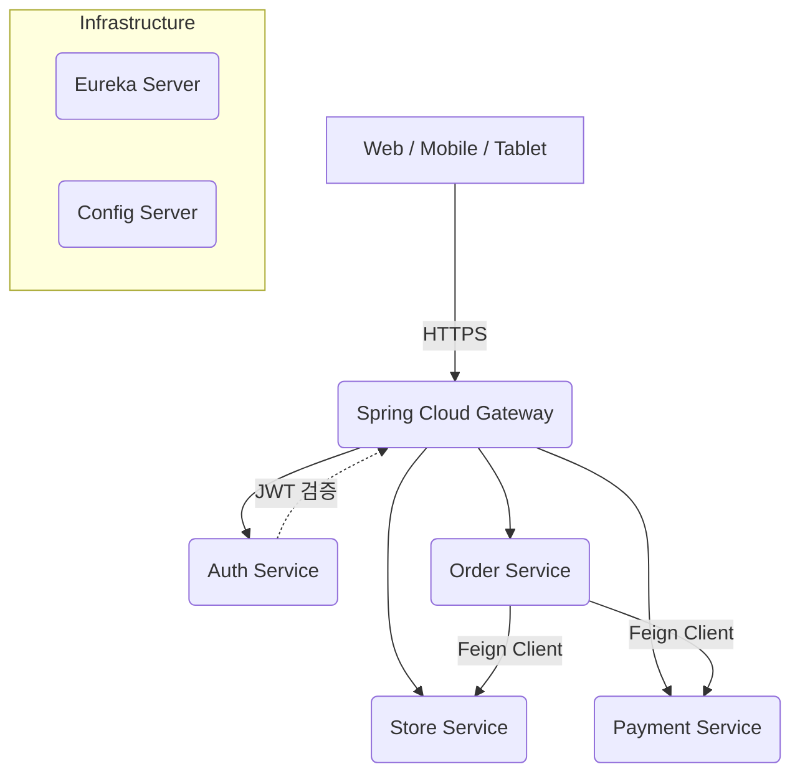

# 02. 시스템 아키텍처 (System Architecture)

## 1. 전체 아키텍처 다이어그램 (MSA)

## 2. 기술 스택 상세

### Backend
| 구분 | 기술 | 설명 |
|---|---|---|
| **Framework** | Spring Boot 3.x | 메인 백엔드 프레임워크 |
| **Language** | Java 17+ | 최신 LTS 버전 사용 |
| **Build Tool** | Gradle (Kotlin DSL) | 멀티 모듈 빌드 관리 |
| **Gateway** | Spring Cloud Gateway | API 라우팅 및 필터링 (인증, 로깅) |
| **Discovery** | Netflix Eureka | 마이크로서비스 인스턴스 등록 및 검색 |
| **ORM** | Spring Data JPA | 데이터베이스 접근 추상화 |
| **DB** | SQLite (Dev) / MySQL (Prod) | 환경별 유연한 DB 선택 |

### Frontend
| 구분 | 기술 | 설명 |
|---|---|---|
| **Framework** | Nuxt.js 3 | Vue 3 기반의 SSR 프레임워크 |
| **State** | Pinia | 가볍고 직관적인 상태 관리 라이브러리 |
| **Style** | Tailwind CSS | 유틸리티 퍼스트 CSS 프레임워크 |
| **HTTP Client** | Ofetch (Nuxt 내장) | API 통신 |

---
