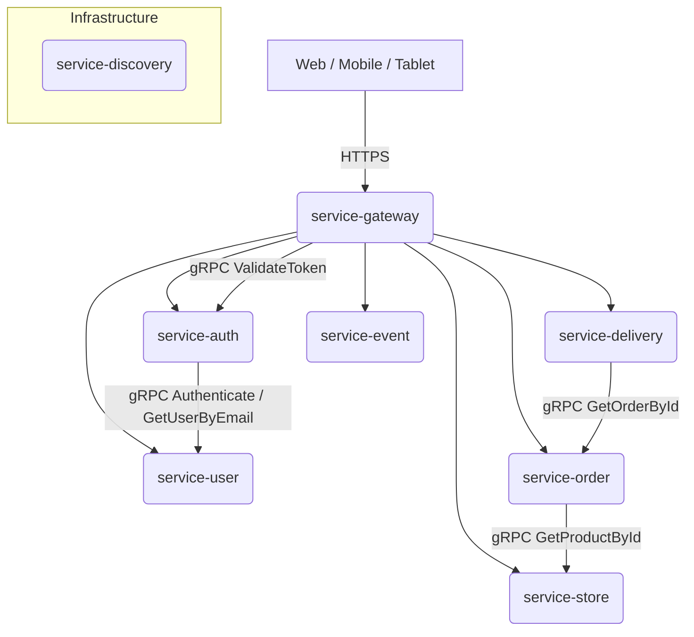

# 02. 시스템 아키텍처 (System Architecture)

> **최종 수정**: 2026-03-15

## 1. 전체 아키텍처 다이어그램 (MSA)

```mermaid
graph TD
    Client[Web / Mobile / Tablet] -->|HTTPS| Gateway(service-gateway)

    subgraph Infrastructure
        Eureka(service-discovery)
    end

    Gateway --> Auth(service-auth)
    Gateway --> User(service-user)
    Gateway --> Store(service-store)
    Gateway --> Order(service-order)
    Gateway --> Delivery(service-delivery)
    Gateway --> Event(service-event)

    Gateway -->|gRPC ValidateToken| Auth
    Auth -->|gRPC Authenticate / GetUserByEmail| User
    Order -->|gRPC GetProductById| Store
    Delivery -->|gRPC GetOrderById| Order
```

> **내부 통신 방식**: Spring gRPC (Protobuf 스키마 기반). Gateway→Auth, Auth→User, Order→Store, Delivery→Order 경로로 gRPC 호출.

## 2. 기술 스택 상세

### Backend
| 구분 | 기술 | 설명 |
|---|---|---|
| **Framework** | Spring Boot 4.0.2 | 메인 백엔드 프레임워크 |
| **Language** | Java 17 (LTS) | Eclipse Temurin JDK 17 |
| **Build Tool** | Gradle 9.2.1 (Groovy DSL) | 멀티 모듈 빌드 관리 |
| **Gateway** | Spring Cloud Gateway (WebFlux) | API 라우팅, JWT 검증, 사용자 헤더 전달 |
| **Discovery** | Netflix Eureka | 마이크로서비스 인스턴스 등록 및 검색 |
| **데이터 접근** | Spring Data JDBC | DB 접근 계층 (JPA 미사용) |
| **DB (Local)** | H2 in-memory | `local` 프로파일 시 SQL 스크립트 자동 실행 |
| **DB (Prod)** | PostgreSQL | 운영 환경 RDBMS (포트 6000) |
| **내부 통신** | Spring gRPC 1.0.2 | 공식 Spring 프로젝트 (net.devh 서드파티 대체) |
| **gRPC 라이브러리** | io.grpc 1.77.1 | Spring gRPC BOM 관리 |
| **Protobuf** | 4.33.2 | Spring gRPC BOM 정렬 |
| **JWT** | jjwt 0.12.6 | Jakarta EE 호환 버전 |
| **Spring Cloud** | 2025.1.0 | Eureka/Gateway BOM |
| **코드 포맷** | Spotless + google-java-format 1.19.2 | CI 포맷 강제 |

### Frontend

| 구분 | 기술 | 설명 |
|---|---|---|
| **Framework** | Nuxt.js 4.2.2 | Vue 3 기반의 SSR 프레임워크 |
| **UI 컴포넌트** | @nuxt/ui 4.3.0 | Tailwind CSS 포함 |
| **상태 관리** | composable (useApi, useAuth) | web-admin / web-shop / web-user 기반 |
| **상태 관리 (customer)** | composable + cookie session | web-user에서 사용 |
| **Style** | Tailwind CSS (@nuxt/ui 포함) | 유틸리티 퍼스트 CSS |
| **HTTP Client** | Ofetch (Nuxt 내장) | API 통신 |
| **패키지 관리자** | pnpm 10.26.1 | 워크스페이스 기반 |

### Mobile (Android)

| 구분 | 기술 | 설명 |
|---|---|---|
| **플랫폼** | Android SDK 34 | minSdk 24, Gradle 8.1.1 |
| **UI** | Material Design 1.10.0 | XML 레이아웃 기반 |
| **앱 구성** | app-android-shop / user / kiosk | 매장용, 고객용, 키오스크용 |

## 3. Gateway 라우팅 원칙

- Gateway는 실제 컨트롤러에 존재하는 경로만 라우팅합니다.
- 공개 경로는 `/api/v1/auth/**`, `/api/v1/users/register`입니다.
- 보호 경로는 `/api/v1/users/**`, `/api/v1/stores/**`, `/api/v1/orders/**`, `/api/v1/deliveries/**`, `/api/v1/events/**`입니다.
- Gateway는 JWT를 검증한 뒤 `X-User-Id`, `X-User-Role` 헤더를 각 서비스에 전달합니다.
- 세부 RBAC와 소유권 검증은 각 서비스의 `@RequireRole`, 인터셉터, 서비스 로직에서 처리합니다.

## 4. 서비스 gRPC 통신 구조

| 호출자 | 대상 | Proto | 용도 |
|---|---|---|---|
| service-gateway | service-auth | `auth.proto` | JWT `ValidateToken` |
| service-auth | service-user | `user.proto` | 사용자 `Authenticate` / `GetUserByEmail` |
| service-order | service-store | `store.proto` | `GetProductById` |
| service-delivery | service-order | `order.proto` | `GetOrderById` |

**클라이언트 빈 등록 방식**: 각 서비스의 `GrpcClientConfig.java`에서 `GrpcChannelFactory`를 통해 `BlockingStub` 빈 생성.  
채널 주소는 `spring.grpc.client.channels.<name>.address`로 `application.yml`에 설정.

## 5. 서비스별 포트 매핑

| 서비스 | HTTP 포트 | gRPC 포트 | Eureka 등록명 |
|---|---|---|---|
| service-discovery | 8100 | — | discovery-service |
| service-gateway | 8000 | — (클라이언트만) | service-gateway |
| service-auth | 7000 | 9000 | service-auth |
| service-user | 8010 | 9010 | service-user |
| service-store | 8020 | 9020 | service-store |
| service-event | 8030 | 9030 | service-event |
| service-order | 8040 | 9040 | service-order |
| service-delivery | 8050 | 9050 | service-delivery |

---