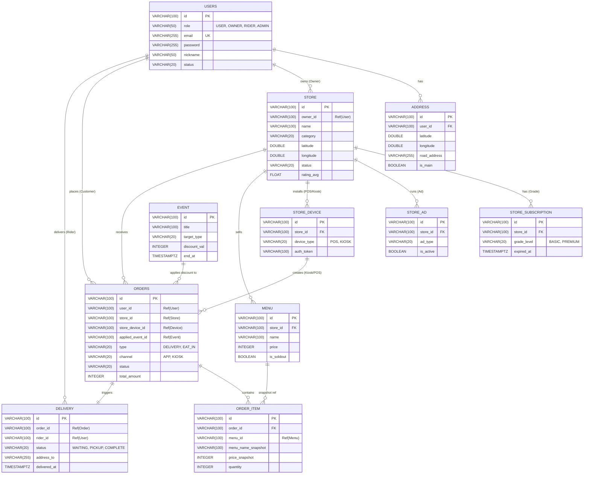

# 📂 Food Delivery & Store Management System - Database Design (ERD)

**Version:** 1.0.0
**Date:** 2026-02-03
**Architecture:** Microservices Architecture (MSA)
**Database:** PostgreSQL (v16+)

---

## 🏗️ 1. 핵심 설계 원칙 (Core Principles)

1.  **ID 전략 (Identity Strategy)**
    * 모든 PK는 **UUID v7 (TSID)** 또는 **ULID**를 사용합니다.
    * DB Auto-Increment 사용을 지양하고, 애플리케이션 레벨에서 ID를 생성하여 분산 환경에서의 충돌을 방지합니다.
    * 타입: `VARCHAR(100)` (가독성 및 호환성 고려)

2.  **서비스 간 참조 (Service References)**
    * 각 마이크로서비스는 독립적인 DB 스키마를 가집니다.
    * 서비스 간의 Join은 불가능하므로, **논리적 ID 참조(Soft Reference)**만 유지합니다.
    * 데이터 무결성은 애플리케이션 레벨(Saga Pattern) 또는 Event Driven Architecture(Kafka)를 통해 관리합니다.

3.  **시간 및 위치 (Time & Location)**
    * 시간: `TIMESTAMPTZ` (UTC 기준 저장 권장)
    * 위치: `DOUBLE PRECISION` (위도/경도) 또는 PostGIS `GEOMETRY(Point, 4326)` 사용.

## 📊 2. 통합 ERD (Overview)



---

## 👤 3. User Service (`db_user`)

사용자, 점주, 라이더, 관리자 등 모든 시스템 참여자를 관리합니다.

### 3.1. Users (사용자 통합)

| Column | Type | Key | Nullable | Description |
| --- | --- | --- | --- | --- |
| `id` | VARCHAR(100) | **PK** | N | UUID (TSID) |
| `email` | VARCHAR(100) | **UK** | N | 로그인 아이디 (이메일) |
| `password` | VARCHAR(255) |  | Y | BCrypt/Argon2 암호화 (소셜로그인 시 NULL) |
| `nickname` | VARCHAR(50) |  | N | 표시 이름 |
| `phone_number` | VARCHAR(20) |  | N | `010-0000-0000` 형식 정규화 |
| `role` | VARCHAR(20) |  | N | `CUSTOMER`, `OWNER`, `RIDER`, `ADMIN` |
| `social_type` | VARCHAR(20) |  | Y | `KAKAO`, `NAVER`, `GOOGLE`, `NONE` |
| `status` | VARCHAR(20) |  | N | `ACTIVE`, `BANNED`, `WITHDRAWN` |
| `created_at` | TIMESTAMPTZ |  | N | 가입 일시 |
| `updated_at` | TIMESTAMPTZ |  | N | 수정 일시 |

### 3.2. Address (주소록)

| Column | Type | Key | Nullable | Description |
| --- | --- | --- | --- | --- |
| `id` | VARCHAR(100) | **PK** | N | UUID |
| `user_id` | VARCHAR(100) | FK | N | `users.id` 참조 |
| `address_name` | VARCHAR(100) |  | Y | `우리집`, `회사` 등 별칭 |
| `road_address` | VARCHAR(255) |  | N | 도로명 주소 |
| `detail_address` | VARCHAR(255) |  | N | 상세 주소 (동/호수) |
| `zip_code` | VARCHAR(10) |  | N | 우편번호 |
| `latitude` | DOUBLE |  | N | 위도 (배달 거리 계산용) |
| `longitude` | DOUBLE |  | N | 경도 (배달 거리 계산용) |
| `is_main` | BOOLEAN |  | N | 기본 배송지 여부 (Default: False) |

---

## 🏪 4. Store Service (`db_store`)

가게 정보, 메뉴, 그리고 수익화 모델(광고, 등급)을 관리합니다.

### 4.1. Store (가게 기본)

| Column | Type | Key | Nullable | Description |
| --- | --- | --- | --- | --- |
| `id` | VARCHAR(100) | **PK** | N | UUID |
| `owner_id` | VARCHAR(100) | IDX | N | `users.id` (Ref) |
| `name` | VARCHAR(100) |  | N | 상호명 |
| `category` | VARCHAR(20) |  | N | `KOREAN`, `CHINESE`, `JAPANESE`, `CAFE`... |
| `tel_number` | VARCHAR(20) |  | N | 가게 전화번호 |
| `address` | VARCHAR(255) |  | N | 가게 주소 |
| `latitude` | DOUBLE |  | N | 위도 |
| `longitude` | DOUBLE |  | N | 경도 |
| `status` | VARCHAR(20) |  | N | `OPEN`, `CLOSED`, `BREAK_TIME` |
| `min_order_amount` | INTEGER |  | N | 최소 주문 금액 |
| `rating_avg` | FLOAT |  | N | 평균 평점 (캐싱, 0.0 ~ 5.0) |
| `review_count` | INTEGER |  | N | 리뷰 수 (캐싱) |

### 4.2. Store Subscription (가게 등급/유료 멤버십)

> **BM 요소**: 가게 사장님이 가입한 요금제 등급을 관리합니다.

| Column | Type | Key | Nullable | Description |
| --- | --- | --- | --- | --- |
| `id` | VARCHAR(100) | **PK** | N | UUID |
| `store_id` | VARCHAR(100) | FK | N | `store.id` 참조 |
| `grade_level` | VARCHAR(20) |  | N | `BASIC` (무료), `PLUS` (수수료↓), `PREMIUM` (상단노출) |
| `started_at` | TIMESTAMPTZ |  | N | 구독 시작일 |
| `expired_at` | TIMESTAMPTZ |  | N | 구독 만료일 |
| `is_auto_renew` | BOOLEAN |  | N | 자동 갱신 여부 |

### 4.3. Store Ad (광고 집행)

> **BM 요소**: 특정 영역(상단, 배너 등)에 노출하기 위한 광고 내역입니다.

| Column | Type | Key | Nullable | Description |
| --- | --- | --- | --- | --- |
| `id` | VARCHAR(100) | **PK** | N | UUID |
| `store_id` | VARCHAR(100) | FK | N | `store.id` 참조 |
| `ad_type` | VARCHAR(20) |  | N | `LIST_TOP`, `MAIN_BANNER`, `CATEGORY_TOP` |
| `priority` | INTEGER |  | N | 노출 우선순위 (높을수록 상단) |
| `started_at` | TIMESTAMPTZ |  | N | 광고 시작 시간 |
| `ended_at` | TIMESTAMPTZ |  | N | 광고 종료 시간 |
| `is_active` | BOOLEAN |  | N | 현재 활성 상태 여부 |

### 4.4. Store Device (단말기 관리)

> **확장성**: 하나의 가게에서 POS기, 키오스크 1, 키오스크 2 등을 구분합니다.

| Column | Type | Key | Nullable | Description |
| --- | --- | --- | --- | --- |
| `id` | VARCHAR(100) | **PK** | N | UUID (Device ID) |
| `store_id` | VARCHAR(100) | FK | N | `store.id` 참조 |
| `device_name` | VARCHAR(50) |  | N | 예: `카운터 포스`, `입구 키오스크` |
| `device_type` | VARCHAR(20) |  | N | `POS`, `KIOSK` |
| `auth_token` | VARCHAR(255) |  | N | 단말기 인증 토큰 (API 호출용) |
| `is_connected` | BOOLEAN |  | N | 현재 접속 여부 (Heartbeat) |

### 4.5. Menu (메뉴)

| Column | Type | Key | Nullable | Description |
| --- | --- | --- | --- | --- |
| `id` | VARCHAR(100) | **PK** | N | UUID |
| `store_id` | VARCHAR(100) | FK | N | `store.id` 참조 (조회 성능 최적화용 역정규화) |
| `category_id` | VARCHAR(100) | FK | N | `menu_category.id` 참조 |
| `name` | VARCHAR(100) |  | N | 메뉴명 |
| `price` | INTEGER |  | N | 가격 |
| `description` | TEXT |  | Y | 메뉴 설명 |
| `image_url` | VARCHAR(255) |  | Y | 메뉴 이미지 URL |
| `is_soldout` | BOOLEAN |  | N | 품절 여부 |

---

## 🛒 5. Order Service (`db_order`)

주문의 생성, 결제, 상태 관리를 담당합니다. 주문 채널(앱/키오스크)을 구분합니다.

### 5.1. Orders (주문 원장)

| Column | Type | Key | Nullable | Description |
| --- | --- | --- | --- | --- |
| `id` | VARCHAR(100) | **PK** | N | UUID |
| `user_id` | VARCHAR(100) | IDX | Y | `users.id` (Ref) - 비회원 주문 시 NULL |
| `store_id` | VARCHAR(100) | IDX | N | `store.id` (Ref) |
| `store_device_id` | VARCHAR(100) |  | Y | `store_device.id` (Ref) - 키오스크 주문 시 |
| `type` | VARCHAR(20) |  | N | `DELIVERY`, `TAKEOUT`, `EAT_IN` (매장식사) |
| `channel` | VARCHAR(20) |  | N | `APP` (앱), `KIOSK` (키오스크), `POS` (현장) |
| `status` | VARCHAR(20) |  | N | `PENDING`, `PAY_COMPLETE`, `COOKING`, `DELIVERING`, `COMPLETE`, `CANCEL` |
| `total_amount` | INTEGER |  | N | 총 결제 금액 |
| `discount_amount` | INTEGER |  | N | 할인 금액 (쿠폰/이벤트) |
| `payment_id` | VARCHAR(100) |  | Y | PG사 결제 고유 번호 |
| `request_msg` | VARCHAR(200) |  | Y | 사장님 요청 사항 |
| `created_at` | TIMESTAMPTZ |  | N | 주문 생성 시간 |

### 5.2. Order Item (주문 상세 - Snapshot)

> **Snapshot 전략**: 메뉴 가격/이름이 변경되어도 과거 주문 내역은 변하면 안 됩니다.

| Column | Type | Key | Nullable | Description |
| --- | --- | --- | --- | --- |
| `id` | VARCHAR(100) | **PK** | N | UUID |
| `order_id` | VARCHAR(100) | FK | N | `orders.id` 참조 |
| `menu_id` | VARCHAR(100) |  | N | `menu.id` (Ref) - 통계용 |
| `menu_name` | VARCHAR(100) |  | N | 주문 당시 메뉴명 (스냅샷) |
| `price` | INTEGER |  | N | 주문 당시 가격 (스냅샷) |
| `quantity` | INTEGER |  | N | 수량 |

---

## 🛵 6. Delivery Service (`db_delivery`)

라이더 배차 및 배송 추적을 담당합니다.

### 6.1. Delivery (배달 정보)

| Column | Type | Key | Nullable | Description |
| --- | --- | --- | --- | --- |
| `id` | VARCHAR(100) | **PK** | N | UUID |
| `order_id` | VARCHAR(100) | **UK** | N | `orders.id` (Ref) |
| `rider_id` | VARCHAR(100) | IDX | Y | `users.id` (Ref) - 배차 전 NULL |
| `status` | VARCHAR(20) |  | N | `WAITING` (배차대기), `ALLOCATED` (배차완료), `PICKUP` (픽업), `COMPLETE` (완료) |
| `address_to` | VARCHAR(255) |  | N | 배달 주소 스냅샷 |
| `latitude_to` | DOUBLE |  | N | 목적지 위도 |
| `longitude_to` | DOUBLE |  | N | 목적지 경도 |
| `delivery_fee` | INTEGER |  | N | 배달 팁 |
| `created_at` | TIMESTAMPTZ |  | N | 배달 접수 시간 |
| `allocated_at` | TIMESTAMPTZ |  | Y | 라이더 배차 시간 |
| `pickup_at` | TIMESTAMPTZ |  | Y | 픽업 시간 |
| `delivered_at` | TIMESTAMPTZ |  | Y | 완료 시간 |

---

## 🎉 7. Marketing Service (`db_marketing`)

쿠폰, 이벤트, 프로모션을 관리합니다.

### 7.1. Event (이벤트/프로모션)

| Column | Type | Key | Nullable | Description |
| --- | --- | --- | --- | --- |
| `id` | VARCHAR(100) | **PK** | N | UUID |
| `title` | VARCHAR(100) |  | N | 이벤트 제목 |
| `target_type` | VARCHAR(20) |  | N | `ALL`, `STORE_SPECIFIC`, `BRAND` |
| `target_id` | VARCHAR(100) |  | Y | 특정 가게/브랜드 ID |
| `discount_type` | VARCHAR(20) |  | N | `FIXED` (금액), `RATE` (비율) |
| `discount_val` | INTEGER |  | N | 할인 값 (1000원 or 10%) |
| `start_at` | TIMESTAMPTZ |  | N | 시작 일시 |
| `end_at` | TIMESTAMPTZ |  | N | 종료 일시 |

---

## 📌 8. 고려사항 및 추후 확장 (ToDo)

1. **정산(Settlement) 서비스**:
* `Order`와 `Delivery` 데이터를 기반으로 일일/주간 정산 데이터를 생성하는 별도 서비스/배치 처리가 필요합니다.


2. **알림(Notification) 서비스**:
* 주문 상태 변경, 배달 시작 등을 알림톡/Push로 발송하는 비동기 서비스 연동.


3. **Redis 활용**:
* 라이더 위치 정보(실시간), 가게 조회수, 인기 검색어 등은 DB 부하를 줄이기 위해 Redis 사용 권장.

```
