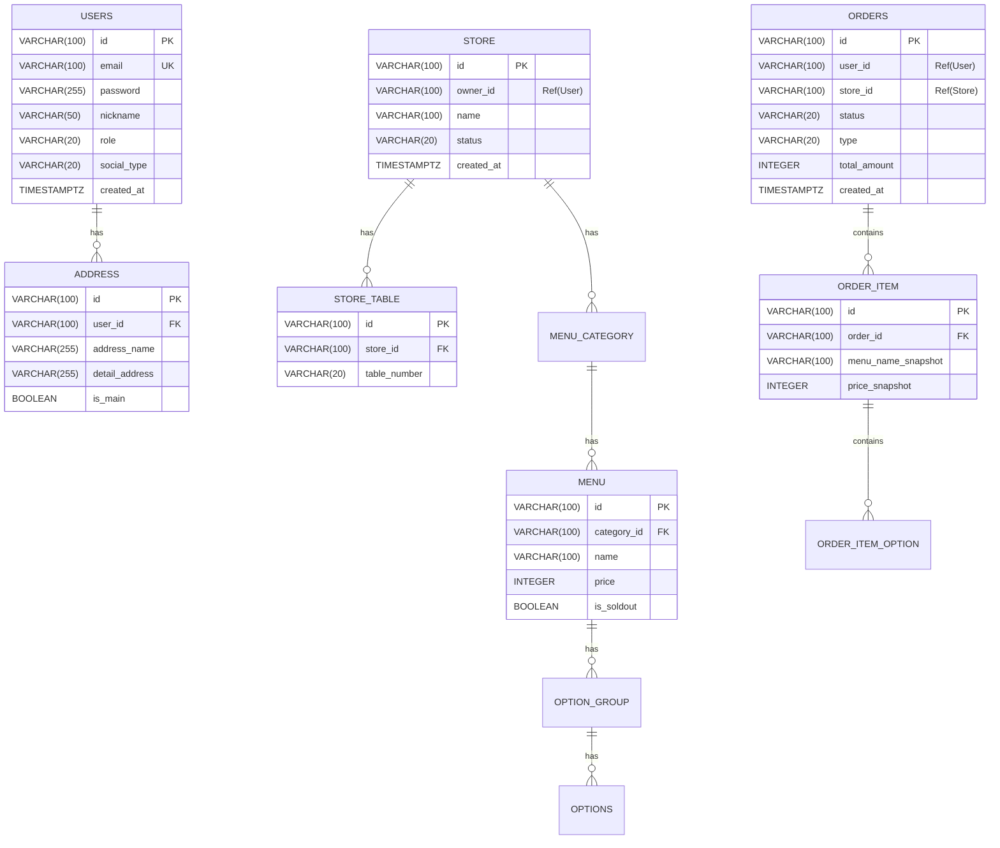

# 10. 초기 데이터베이스 모델링 (ERD)

본 문서는 프로젝트의 초기 도메인 모델을 정의합니다.
**PostgreSQL**을 기준으로 하며, 마이크로서비스 아키텍처(MSA) 원칙에 따라 각 서비스는 독립적인 데이터베이스 스키마를 가집니다.

## 📌 핵심 설계 원칙

1.  **ID 전략**: 모든 Primary Key는 `VARCHAR(100)`을 사용합니다.
    *   DB의 Auto Increment(Sequence)에 의존하지 않고, **애플리케이션 계층(Java)에서 UUID(v7/ULID)를 생성**하여 할당합니다.
    *   이는 분산 환경에서의 ID 충돌 방지 및 DB 마이그레이션 용이성을 위함입니다.
2.  **시간대(Timezone)**: 모든 날짜/시간 필드는 `TIMESTAMPTZ`를 사용합니다.
    *   글로벌 서비스 확장을 고려하여 UTC 기준 또는 Timezone 정보를 포함하여 저장합니다.
3.  **관계(Relation)**:
    *   **서비스 내부**: 물리적 Foreign Key(FK) 제약조건을 설정하여 무결성을 보장합니다.
    *   **서비스 간**: 물리적 제약조건 없이 **논리적 ID 참조(Loose Reference)**만 유지합니다.

---

## 1. ERD 다이어그램 (Mermaid)

---

## 2. 서비스별 테이블 상세 정의

### 👤 2.1. User Service (`db_user`)

**`users`** (회원 정보)
| Column | Type | Key | Description |
| :--- | :--- | :--- | :--- |
| `id` | **VARCHAR(100)** | **PK** | UUID/ULID (App 생성) |
| `email` | VARCHAR(100) | UK | 로그인 이메일 |
| `password` | VARCHAR(255) | | BCrypt 암호화 (소셜로그인 시 NULL) |
| `nickname` | VARCHAR(50) | | 사용자 닉네임 |
| `role` | VARCHAR(20) | | `CUSTOMER`, `OWNER`, `RIDER`, `ADMIN` |
| `social_type` | VARCHAR(20) | | `KAKAO`, `NAVER`, `GOOGLE`, `NONE` |
| `created_at` | **TIMESTAMPTZ** | | 가입 일시 |
| `updated_at` | **TIMESTAMPTZ** | | 수정 일시 |

**`address`** (배송지 정보)
| Column | Type | Key | Description |
| :--- | :--- | :--- | :--- |
| `id` | **VARCHAR(100)** | **PK** | UUID/ULID |
| `user_id` | VARCHAR(100) | FK | `users.id` 참조 |
| `address_name` | VARCHAR(255) | | 도로명/지번 주소 |
| `detail_address` | VARCHAR(255) | | 상세 주소 |
| `is_main` | BOOLEAN | | 기본 배송지 여부 |

---

### 🏪 2.2. Store Service (`db_store`)

**`store`** (가게 정보)
| Column | Type | Key | Description |
| :--- | :--- | :--- | :--- |
| `id` | **VARCHAR(100)** | **PK** | UUID/ULID |
| `owner_id` | VARCHAR(100) | | `users.id` 논리적 참조 (Index 권장) |
| `name` | VARCHAR(100) | | 가게 이름 |
| `status` | VARCHAR(20) | | `OPEN`, `CLOSED`, `BREAK_TIME` |
| `min_order_amount`| INTEGER | | 최소 주문 금액 |

**`store_table`** (매장 테이블 / POS용)
| Column | Type | Key | Description |
| :--- | :--- | :--- | :--- |
| `id` | **VARCHAR(100)** | **PK** | UUID/ULID |
| `store_id` | VARCHAR(100) | FK | `store.id` 참조 |
| `table_number` | VARCHAR(20) | | 테이블 번호 (예: "A-1") |
| `x_position` | INTEGER | | 매장 배치도 X좌표 |
| `y_position` | INTEGER | | 매장 배치도 Y좌표 |

**`menu`** (메뉴 정보)
| Column | Type | Key | Description |
| :--- | :--- | :--- | :--- |
| `id` | **VARCHAR(100)** | **PK** | UUID/ULID |
| `category_id` | VARCHAR(100) | FK | `menu_category.id` 참조 |
| `name` | VARCHAR(100) | | 메뉴명 |
| `price` | INTEGER | | 가격 |
| `is_soldout` | BOOLEAN | | 품절 여부 |

---

### 🛒 2.3. Order Service (`db_order`)

**`orders`** (주문 원장)
| Column | Type | Key | Description |
| :--- | :--- | :--- | :--- |
| `id` | **VARCHAR(100)** | **PK** | UUID/ULID |
| `user_id` | VARCHAR(100) | | `users.id` 논리적 참조 (비회원 NULL) |
| `store_id` | VARCHAR(100) | | `store.id` 논리적 참조 |
| `store_table_id` | VARCHAR(100) | | 매장 식사 시 테이블 ID |
| `type` | VARCHAR(20) | | `DELIVERY`, `EAT_IN`, `PACKAGING` |
| `status` | VARCHAR(20) | | `PENDING`, `COOKING`, `DELIVERING`... |
| `total_amount` | INTEGER | | 총 결제 금액 |
| `created_at` | **TIMESTAMPTZ** | | 주문 생성 시간 |

**`order_item`** (주문 상세 - 스냅샷)
> **Snapshot Pattern**: 메뉴 가격이나 이름이 변경되더라도 주문 당시의 기록은 변하지 않아야 하므로, 원본 데이터를 복사하여 저장합니다.

| Column | Type | Key | Description |
| :--- | :--- | :--- | :--- |
| `id` | **VARCHAR(100)** | **PK** | UUID/ULID |
| `order_id` | VARCHAR(100) | FK | `orders.id` 참조 |
| `menu_id` | VARCHAR(100) | | 원본 메뉴 ID (통계용) |
| `menu_name_snapshot`| VARCHAR(100) | | 주문 당시 메뉴명 |
| `price_snapshot` | INTEGER | | 주문 당시 가격 |
| `quantity` | INTEGER | | 주문 수량 |

**`order_item_option`** (옵션 상세 - 스냅샷)
| Column | Type | Key | Description |
| :--- | :--- | :--- | :--- |
| `id` | **VARCHAR(100)** | **PK** | UUID/ULID |
| `order_item_id` | VARCHAR(100) | FK | `order_item.id` 참조 |
| `option_name_snapshot`| VARCHAR(50) | | 주문 당시 옵션명 |
| `extra_price_snapshot`| INTEGER | | 주문 당시 옵션 추가금 |