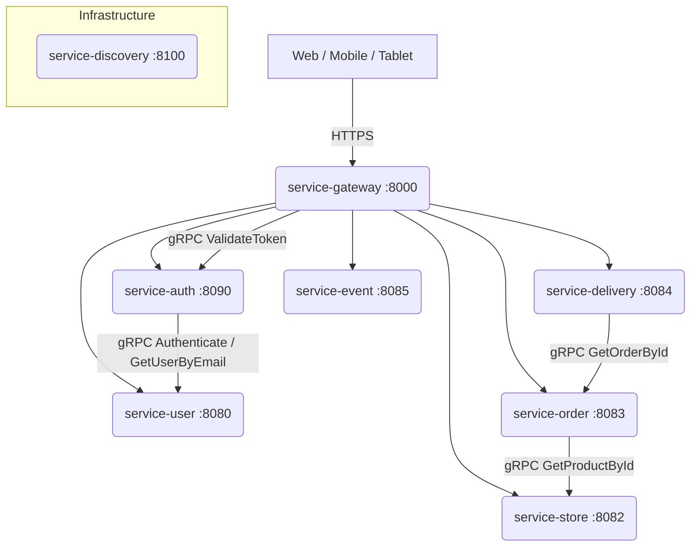

---
tags:
  - 아키텍처
  - MSA
  - gRPC
관련:
  - "[[03_기술_스택]]"
  - "[[04_마이크로서비스]]"
---

# 02. 시스템 아키텍처

> **최종 수정**: 2026-03-15

---

## 🗺️ 전체 아키텍처 다이어그램



> [!info] 내부 통신 방식
> **Spring gRPC (Protobuf 스키마 기반)**
> - Gateway → Auth: 토큰 검증
> - Auth → User: 사용자 인증 / 이메일 조회
> - Order → Store: 상품 정보 조회
> - Delivery → Order: 주문 정보 조회

---

## 🌐 Gateway 라우팅 원칙

| 경로 | 인증 필요 | 설명 |
|---|---|---|
| `/api/v1/auth/**` | ❌ 공개 | 로그인 / 회원가입 |
| `/api/v1/users/register` | ❌ 공개 | 사용자 등록 |
| `/api/v1/stores` (GET) | ❌ 공개 | 매장 목록 조회 |
| `/api/v1/stores/*` (GET) | ❌ 공개 | 매장 상세 조회 |
| `/api/v1/stores/*/menus` (GET) | ❌ 공개 | 메뉴 조회 |
| `/api/v1/users/**` | ✅ 인증 | 사용자 관리 |
| `/api/v1/orders/**` | ✅ 인증 | 주문 관리 |
| `/api/v1/deliveries/**` | ✅ 인증 | 배달 관리 |
| `/api/v1/events/**` | ✅ 인증 | 이벤트 관리 |

> [!tip] 헤더 전달 방식
> Gateway가 JWT 검증 후 `X-User-Id`, `X-User-Role` 헤더를 각 서비스에 전달.
> 내부 서비스는 이 헤더를 **직접 JWT 클레임과 대조**하여 헤더 스푸핑을 방어.

---

## 🔗 gRPC 통신 구조

### 서비스별 gRPC 포트

| 서비스 | HTTP | gRPC |
|---|---|---|
| service-auth | 8090 | 9090 |
| service-user | 8080 | 9080 |
| service-store | 8082 | 9082 |
| service-order | 8083 | 9083 |
| service-delivery | 8084 | 9084 |
| service-event | 8085 | 9085 |

### gRPC 호출 흐름

```
[Gateway] --- ValidateToken ---> [service-auth]
[service-auth] --- GetUserByEmail / Authenticate ---> [service-user]
[service-order] --- GetProductById ---> [service-store]
[service-delivery] --- GetOrderById ---> [service-order]
```

### 환경 변수 (gRPC 주소)

```properties
SERVICE_AUTH_GRPC_ADDR=localhost:9090
SERVICE_USER_GRPC_ADDR=localhost:9080
SERVICE_STORE_GRPC_ADDR=localhost:9082
SERVICE_ORDER_GRPC_ADDR=localhost:9083
```

---

## 🏠 로컬 개발 실행 순서

```
1. service-discovery  (Eureka: 8100)
2. service-gateway    (Gateway: 8000)
3. service-auth       (Auth: 8090)
4. service-user       (User: 8080)
5. service-store      (Store: 8082)
6. service-order      (Order: 8083)
7. service-delivery   (Delivery: 8084)
8. service-event      (Event: 8085)
```

> [!warning] 주의사항
> MSA 특성상 **실행 순서**가 중요합니다.
> Discovery → Gateway → Core Services 순서로 기동하세요.

---

## 🔗 연관 문서

- [[03_기술_스택]] - 사용 기술 상세
- [[04_마이크로서비스]] - 서비스별 역할 및 API
- [[07_개발환경_설정]] - 로컬 실행 방법

#아키텍처 #MSA #gRPC #Gateway
