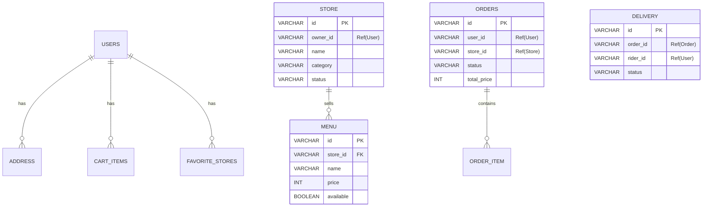

---
tags:
  - 데이터베이스
  - ERD
  - PostgreSQL
  - H2
관련:
  - "[[04_마이크로서비스]]"
---

# 05. 데이터베이스 전략

> **최종 수정**: 2026-03-15

---

## 📐 핵심 설계 원칙

> [!info] Database per Service
> 각 마이크로서비스는 **독립된 DB 스키마**를 가집니다.
> 서비스 간 JOIN은 불가능하며, **논리적 ID 참조(Soft Reference)**만 유지합니다.
> 데이터 무결성은 애플리케이션 레벨 또는 이벤트 기반(Kafka 예정)으로 관리합니다.

### ID 전략

- 모든 PK: **UUID v7 (TSID)** 또는 **ULID** 사용
- DB Auto-Increment **미사용** → 애플리케이션 레벨에서 생성
- 타입: `VARCHAR(100)` (가독성 및 호환성 고려)

### 시간 / 위치

- 시간: `TIMESTAMPTZ` (UTC 기준 저장 권장)
- 위치: `DOUBLE PRECISION` (위도/경도) 또는 PostGIS `GEOMETRY(Point, 4326)`

---

## 🔄 환경별 DB 분리 전략

Spring Profiles 기능으로 설정 파일 변경만으로 DB를 교체합니다.
**ORM**: Spring Data JDBC (JPA/Hibernate 미사용)

### Local 환경 (`local` 프로파일)

```yaml
spring:
  datasource:
    url: jdbc:h2:mem:testdb;DB_CLOSE_DELAY=-1
    driver-class-name: org.h2.Driver
  sql:
    init:
      mode: always
      schema-locations: classpath:schema.sql
      data-locations: classpath:data.sql
```

| 항목 | 내용 |
|---|---|
| DBMS | H2 in-memory |
| 장점 | 별도 DB 서버 불필요, 서비스 시작 시 SQL 자동 실행 |
| 스키마 | `schema.sql` 직접 작성 |

### Production 환경 (`prod` 프로파일)

```yaml
spring:
  datasource:
    url: jdbc:postgresql://db-server:6000/mydb
    username: ${DB_USER}
    password: ${DB_PASSWORD}
  sql:
    init:
      mode: never
```

| 항목 | 내용 |
|---|---|
| DBMS | PostgreSQL (포트 6000) |
| 특징 | 동시성, 트랜잭션 안정성, 대용량 처리 |
| 스키마 | DDL 자동 생성 없음 - SQL 스크립트 직접 정의 |

---

## 🗃️ 서비스별 DB 스키마 분리

| 서비스 | DB 스키마 | 핵심 테이블 |
|---|---|---|
| service-user | `db_user` | users, addresses, cart_items, favorite_stores, user_notifications, mail_messages |
| service-auth | `db_user` | refresh_tokens *(user DB 공유)* |
| service-store | `db_store` | store, menu |
| service-order | `db_order` | orders, order_item |
| service-delivery | `db_delivery` | delivery |
| service-event | `db_event` | events |

---

## 📊 ERD 개요

### 도메인별 핵심 테이블



### service-user 상세

| 컬럼 | 타입 | 설명 |
|---|---|---|
| `id` | VARCHAR(100) PK | UUID v7 |
| `email` | VARCHAR(255) UK | 이메일 (고유) |
| `password_hash` | VARCHAR | 비밀번호 해시 |
| `name` | VARCHAR(50) | 사용자 이름 |
| `roles` | VARCHAR(50) | `USER`, `OWNER`, `RIDER`, `ADMIN` |
| `provider` | VARCHAR | OAuth2 제공자 |
| `created_at` | TIMESTAMPTZ | 생성 시각 |

### service-auth 상세

| 컬럼 | 타입 | 설명 |
|---|---|---|
| `id` | VARCHAR(100) PK | - |
| `user_id` | VARCHAR | Ref(User) |
| `token` | VARCHAR | **SHA-256 해시** 저장 |
| `created_at` | TIMESTAMPTZ | 발급 시각 |

> [!warning] Refresh Token 보안
> Refresh Token은 평문이 아닌 **SHA-256 해시값**으로 저장합니다. (2026-04-05 보안 하드닝 적용)

### service-store 상세

- `Store`: `id`, `name`, `address`, `phone`, `category`, `status`, `lat`, `lng`, `rating`, `owner_id`
- `Menu`: `id`, `store_id`, `name`, `description`, `price`, `available`

### service-order 상세

- `Orders`: `id`, `user_id`, `store_id`, `status`, `total_price`, `created_at`
- `OrderItem`: `id`, `order_id`, `menu_id`, `quantity`, `price`

### service-delivery 상세

- `Delivery`: `id`, `order_id`, `rider_id`, `status`, `fee`, `created_at`

---

## 🌱 DB 시드 데이터

| 파일 위치 | 내용 |
|---|---|
| `database/07~11_remote_db_*_seed.sql` | user / store / order / delivery / event 각 5건 |
| `database/init/00_create_databases.sql` | Docker 컨테이너 초기화용 스키마 생성 |
| `database/apply-db-seeds.ps1` | 시드 데이터 순차 적용 자동화 스크립트 |

---

## 🔗 연관 문서

- [[04_마이크로서비스]] - 서비스별 역할
- [[07_개발환경_설정]] - 로컬 DB 실행 방법
- [[08_배포_전략]] - Docker Compose DB 설정

#데이터베이스 #ERD #PostgreSQL #H2 #MSA
